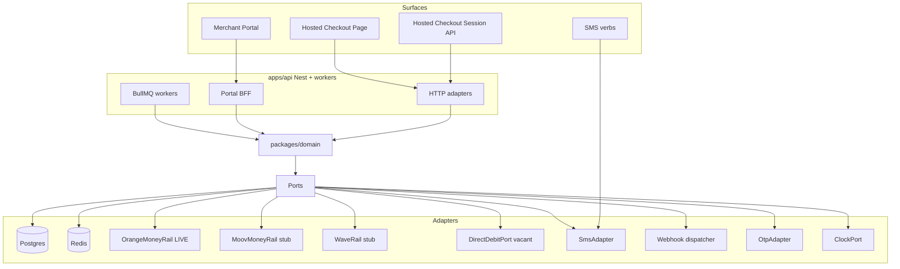
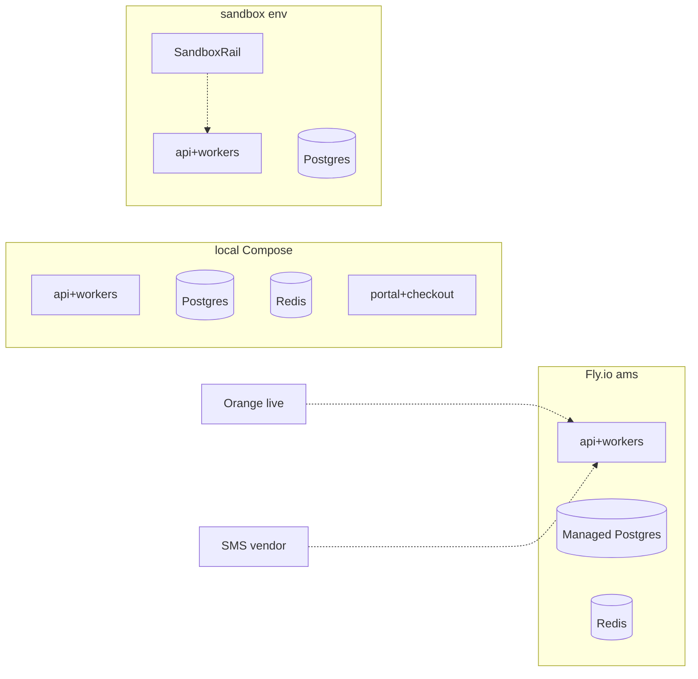
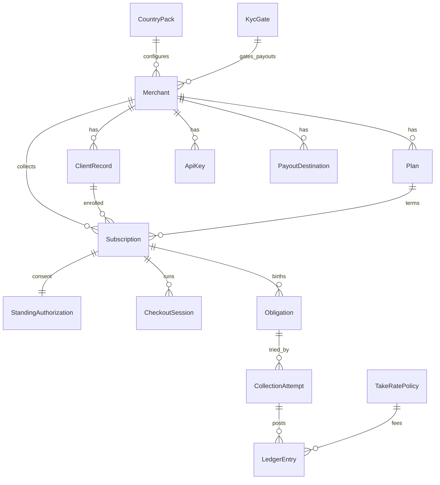

# Architecture Spine — Sarati

## Product identity

| | |
| --- | --- |
| **Product name** | **Sarati** |
| **Etymology** | Dioula/Jula — *sarati* means agreement / contract / terms |
| **Primary domain** | **sarati.net** (purchased by the product owner; public web presence) |
| **Market** | Burkina Faso first; multi-country / multi-currency sockets later |
| **Planning repo** | https://github.com/usfaa444/subscription-bmad-planning |

### Recommended public hostnames (not live)

These are **recommendations** for when surfaces are deployed under sarati.net. They are not claimed as already provisioned or live:

| Surface | Suggested hostname |
| --- | --- |
| Marketing / product home | `sarati.net` / `www.sarati.net` |
| Merchant Portal | `app.sarati.net` |
| Hosted Checkout Page | `checkout.sarati.net` |
| Customer pay / Magic Link landing (if split from checkout) | `pay.sarati.net` |
| Public API (optional) | `api.sarati.net` |

Exact DNS and TLS cutover are ops/implementation; architecture only recommends subdomain roles so CountryPack and surface apps do not invent alternate brand domains.

## Design Paradigm

Hexagonal (ports-and-adapters) inside a **modular monolith**. Domain core owns entities, the Consent State Machine, and all money/consent mutations. NestJS HTTP + portal BFF + BullMQ workers, Postgres repos, and rail/SMS adapters sit outside ports. Next.js apps (`portal`, `checkout`) are browser clients only — they call `apps/api`, they are not BFFs. One deployable API process plus workers. Microservices are out until a later spine says otherwise.



## Invariants & Rules

### AD-1 — Hexagonal modular monolith [ADOPTED]

- **Binds:** all
- **Prevents:** a second product/event-bus for API vs portal; microservices-first split; domain importing Nest, Next, `pg`, Redis, or rail SDKs
- **Rule:** Ship one NestJS API + BullMQ workers. `packages/domain` contains entities, ports, and domain services only. Adapters implement ports. `apps/api` composes. Split a process only after a new AD.

### AD-2 — Ports catalog [ADOPTED]

- **Binds:** FR-21, FR-22, FR-48, FR-18, FR-29, FR-12, FR-16, FR-36, NFR-5, NFR-10
- **Prevents:** vendor calls from domain, portal, or checkout; inventing a second collect interface per rail
- **Rule:** The only outbound contracts are `PaymentRailPort` (collect), `DirectDebitPort` (vacant: NotImplemented — no MVP call, no Sandbox debit toggle), `SmsPort`, `WebhookDeliveryPort`, `OtpPort`, `ClockPort` / `CalendarPort` (CountryPack holidays). New vendors = new adapters, same ports.

### AD-3 — One Consent State Machine, two skins [ADOPTED]

- **Binds:** FR-10–FR-17, FR-19, FR-54, UJ-1–UJ-3
- **Prevents:** portal vs API consent objects; Customer password accounts; treating SMS as a different protocol
- **Rule:** Every enrollment (Invite SMS or Hosted Checkout Session) runs identify → consent → method → confirm. Both persist the same `StandingAuthorization`. Customer identity is Magic Link or OTP only. Hosted Checkout Page and SMS verbs are renderers; a later USSD renderer may attach without a new machine. No platform shortcode in MVP (FR-49).

### AD-4 — Reminder-then-pay only [ADOPTED]

- **Binds:** FR-11, FR-20, FR-48, NFR-3, safety guardrail
- **Prevents:** auto-debit marketing; merchant-initiated Orange pull; using today’s consent as a PI-SPI mandate
- **Rule:** Jobs may send SMS Invoice / reminders. `PaymentRailPort.collect` runs only after a Customer confirm on **that** `CollectionAttempt`, or Merchant Cash Mark-paid. `DirectDebitPort` is never invoked. Enabling it later requires a **new** `StandingAuthorization` text version (AD-11). Copy must not claim prélèvement automatique / auto-debit. `rail.poll` and inbound Rail webhooks may refresh status only — they must not collect.

### AD-5 — Rails and pay-time method [ADOPTED]

- **Binds:** FR-8, FR-19, FR-21, FR-22, FR-23
- **Prevents:** Plan-locked Orange; live Moov/Wave; cash as a fake Rail; domain hard-lock of Orange aggregator vs local API
- **Rule:** Resolution is CountryPack → scheme → Rail → Adapter. Live adapter: `OrangeMoneyRail`. Designed stubs: `MoovMoneyRail`, `WaveRail` (same `PaymentRailPort`; not live). Cash Mark-paid is a `CollectionAttempt` method, not a Rail. Customer chooses method at the `method` step. Rail-wallet MSISDN may differ from the enrolled Customer MSISDN; whoever confirms on Orange pays for the enrolled number — no second-payer fields. Orange commercial counterparty (local merchant API vs BF aggregator) is adapter config; FR-21 is the outcome. Operator USSD / in-app approve is Rail-wallet confirm, not a platform shortcode.

### AD-6 — CountryPack and tenancy [ADOPTED]

- **Binds:** FR-45–FR-47, NFR-1, NFR-9, FR-3
- **Prevents:** `if` Burkina branches; global XOF / +226 constants; missing `merchant_id`; UUID-vs-ULID drift
- **Rule:** Locale, rails, KYC rules, holidays, MSISDN parse, wallet prefixes, currency, timezone come from `CountryPack`. BF is the only production pack. Every tenant row has `merchant_id`. `country_code` comes from the Merchant’s pack. Public IDs are ULID; country is an attribute, not an ID prefix. Portal and API share one Merchant account and the same aggregates.

### AD-7 — Ledger, pass-through, Payout Clock [ADOPTED]

- **Binds:** FR-34–FR-39, FR-38, NFR-5
- **Prevents:** Customer wallets; SOLDE as a platform balance; silent settlement; implementing float without counsel
- **Rule:** Ledger events: `intent`, `authorized`, `collected`, `settled`, `failed`, `written-off`, `reversed`. `refunded` is reserved; no Merchant-initiated refund in MVP. No Customer-visible wallet. Prefer pass-through to Payout Destination (MVP: Orange Money MSISDN). Do not implement platform float until counsel writes the control. Customer-paid is immediate on Rail success or Cash Mark-paid (cash = already received). Merchant-received target is T+1 CountryPack business day via `ClockPort`; late shows `pending settlement` + last Rail status. Label is a target, not a guarantee.

### AD-8 — Idempotent attempts and signed webhooks [ADOPTED]

- **Binds:** FR-16, FR-24, NFR-3, NFR-10
- **Prevents:** double Orange debit; unsigned callbacks; each builder inventing retry math
- **Rule:** Each `CollectionAttempt` has an idempotency token; at most one live debit per token. An open Obligation has at most one in-flight collect Attempt. PAY and Hosted confirm reuse that Attempt; Merchant retry is allowed only after the prior Attempt is `failed` or `expired`, and then mints a new token. Session create and Attempt confirm require header `Idempotency-Key`. Domain events write a Postgres outbox in the same transaction as the aggregate. `webhook.deliver` is at-least-once. Sign with HMAC-SHA256 over `timestamp.rawBody`; header `X-Webhook-Signature` (`t=` and `v1=`). Reject if timestamp skew exceeds 300 seconds. Retry 1m / 5m / 15m / 1h / 6h / 24h then dead-letter. Merchant replay and signing-secret rotation live on Developers; replay must not re-debit. Inbound Orange/Rail callbacks authenticate per adapter (shared secret or allow-list); unauthenticated rail success is ignored.

### AD-9 — Obligation birth and lifecycle [ADOPTED]

- **Binds:** FR-9, FR-25–FR-28, FR-51–FR-56
- **Prevents:** minting debt on Invite SMS; SMS adapter owning schedule; Cancel vs Session `cancelled` collapse
- **Rule:** The only mint function is domain `ObligationBirth.mintCurrent`. Session confirm (in the same HTTP transaction, for collect-now) and the `obligation.birth` worker both call it. Unique key: `subscription_id` + `cycle_key`. Abandoned Session / Invite SMS mint none. If due date is today or past at confirm, mint due now. While Paused, no new Obligations. One SMS Invoice at mint-if-due and on each later due date; at most one reminder 48h later unless Merchant retries. Pause / Skip / Cancel / Resume live on `Subscription` (AD-15). Subscription Cancel emits `subscription.cancelled`, distinct from Session `cancelled`. Rail Reversal re-opens the Obligation for reversed XOF, claws that Attempt’s Take-rate, does not reset first-success, and clears Customer-paid on that Attempt. `SmsPort` must not mint. Partial Rail success: Take-rate on collected XOF only; remainder stays open on a new Attempt.

### AD-10 — Take-rate and KYC gates [ADOPTED]

- **Binds:** FR-40–FR-44
- **Prevents:** fee math in UI; charging cash/fail/Sandbox; stopping invoices at KYC; resetting first-success on reversal
- **Rule:** `TakeRatePolicy` is the only fee authority. BF pack values: 0% on a Merchant’s first successful **live** MoMo collect; then 2.5% of Rail-collected integer amount (half-up) computed at `collected`. Rates and the KYC threshold live on the policy / CountryPack — not as UI constants. 0% on fail, Cash Mark-paid, Sandbox. Sandbox `collected` does not increment first-success, Take-rate, or `KycGate` sums. Rail Reversal claws that Attempt’s fee and does not reset first-success. `KycGate` blocks **payouts** (not invoicing/SMS) when live MoMo collected + Cash Mark-paid exceed the pack threshold (BF: 500000 XOF) in a CountryPack calendar month, or Payout Destination changes while informal. Accepted flag may be set by manual review. KYC document blobs are private object storage; not logged.

### AD-11 — Auth, secrets, sandbox, PII [ADOPTED]

- **Binds:** FR-4, FR-5, FR-12, FR-14, FR-17, FR-50, NFR-6, NFR-7, NFR-12
- **Prevents:** Customer passwords; recoverable live API keys; sandbox hitting live Orange; full MSISDN in prod logs; reuse of reminder-then-pay consent for Direct Debit
- **Rule:** Customer: Magic Link or OTP, TTL 15 minutes. Merchant: MSISDN OTP; Staff PIN hashed at rest (argon2id); when enabled it is required for Cash Mark-paid, retry, payout change, API-key reveal, Cancel, Client Record remove, Write-off. API keys hashed at rest; live secret shown once. Hosted Checkout Session API accepts no Rail PIN/OTP/secrets. Sandbox uses a separate key namespace and `SandboxRail`; no live Orange credentials in sandbox env. Prod logs, job payloads, and traces mask MSISDN to last 4. Store consented text version on `StandingAuthorization`. No Customer email harvest.

### AD-12 — Public API contract [ADOPTED]

- **Binds:** FR-14, FR-16, §16, NFR-1
- **Prevents:** a second Session type per rail; renamed statuses; English-default Merchant errors
- **Rule:** Public prefix `/v1`. Next breaking rename is `/v2` (dated by URL, not by header). Session statuses (only on `CheckoutSession`): `authorized`, `collected`, `failed`, `expired`, `cancelled`, `settled`. Ledger/Attempt events (AD-7) are a different enum — do not reuse Session words on Attempts except `collected` / `failed` / `settled` with the ledger meaning. Additive Rails or a future Direct Debit Port must not mint a new Session type. Merchant-facing error `message` is French; `code` may be an English identifier. Session TTL 24 hours. Retrieve: `GET /v1/checkout/sessions/:id`.

### AD-13 — Jobs, money, time [ADOPTED]

- **Binds:** FR-53, FR-29, FR-35, FR-36, FR-47, NFR-2
- **Prevents:** queue-name drift; floating-point money; server-local due dates
- **Rule:** BullMQ queues: `obligation.birth`, `reminder.dispatch`, `sms.send`, `webhook.deliver`, `rail.poll`. Only domain services mutate aggregates from workers. Store amounts as integers in CountryPack minor units (XOF scale 0) plus `currency_code`. Persist timestamps UTC; interpret due dates and T+1 via CountryPack timezone (BF: Africa/Ouagadougou) and `CalendarPort`. SMS verbs PAY, PAUSE, SOLDE, AIDE, STOP, ANNULER, REPRENDRE — accent-insensitive. STOP ends non-essential SMS only and is not Cancel; transactional invite/invoice/failure/receipt still send until ANNULER, Merchant Cancel, or Client Record remove — disclosed in consent. Second STOP within 24 hours replies with ANNULER instructions only. Success produces exactly one SMS Receipt (silence otherwise). Invite, invoice, receipt, failure, AIDE, and SOLDE include Merchant display name. SMS Invoice answers what / to whom / how often / how much / by when / how to pay. `SmsPort` hides vendor. Inbound vendor SMS webhook hits `apps/api` and dispatches `SmsVerbHandler` in domain. PAY / FR-54: reuse the in-flight Attempt (AD-8) → OTP → `PaymentRailPort.collect` (operator USSD/in-app, not a platform shortcode). SOLDE never shows a platform-held balance.

### AD-14 — Deploy and operations [ADOPTED]

- **Binds:** NFR-2, NFR-4, NFR-9, §14, §17
- **Prevents:** three clouds; sandbox/prod credential mix; unmasked PII in traces; assuming in-country compute
- **Rule:** Production is Fly.io, primary region `ams` (Amsterdam) — verified gateway + Managed Postgres. Production Postgres major is **17** (`fly mpg create --pg-major-version 17`; MPG supports 16 or 17, not 18). Production Redis is Fly Upstash Redis on a **fixed** plan (not PAYG — BullMQ polls when idle). Local Compose uses `postgres:17` and Redis 8.10.1. Environments: `local` | `sandbox` | `production`. `livemode` is on every money row; sandbox process has no live Orange env. Observability: OpenTelemetry Node SDK + structured JSON logs (OTLP exporter); never log full MSISDN in prod (jobs and traces included). Do not bind `@nestjs/observe` SaaS — it is a hosted APM, not the OTel port. CountryPack must not assume BF compute. Multi-region (including `jnb`) is Deferred. Operators see Adapter-level Rail outcome without exposing secrets to Merchants.



### AD-15 — Shared aggregates and uniqueness [ADOPTED]

- **Binds:** FR-3, FR-7, FR-10, FR-14, FR-27, FR-51, FR-52
- **Prevents:** two Consent machines; two ClientRecords per phone; Pause/Cancel on two roots
- **Rule:** `Subscription` is the relationship root (Merchant + ClientRecord + Plan + StandingAuthorization). Pause, Resume, Skip, Cancel live on `Subscription`. `CheckoutSession` is the persisted Consent State Machine run for **both** skins (`origin` = `api` or `portal_invite`). Invite SMS creates a Session. PAY / FR-54 resumes the latest open Session or the in-flight Attempt for that Subscription. `ClientRecord` is unique on `merchant_id` + normalized MSISDN; duplicate insert is rejected (no silent merge). Removing a Client Record Cancels every Subscription with that Customer for the Merchant. Session create may imply a ClientRecord for that pair.

### AD-16 — Single writers [ADOPTED]

- **Binds:** FR-20–FR-26, FR-34–FR-37, FR-55, FR-56
- **Prevents:** cash vs rail vs settlement each owning LedgerEntry
- **Rule:** `CollectionService` is the only writer of `CollectionAttempt` and collect/cash/reversal transitions. `LedgerService` is the only writer of `LedgerEntry`. `SettlementService` (driven by `rail.poll` / inbound rail status) is the only writer of Merchant-received / `settled`. Portal Cash Mark-paid and SMS PAY call `CollectionService`, not the repo.

### AD-17 — Persistence and starters [ADOPTED]

- **Binds:** all persistence; apps/api bootstrap
- **Prevents:** Prisma-vs-Drizzle fork; TypeScript 7 vs Nest 12; mixed module systems
- **Rule:** One ORM: Prisma **7.10.0** (`prisma` + `@prisma/client` 7.x stable — not Prisma 8 RC). Migrations are the only schema path. Nest app is ESM (`nest new` default): TypeScript **6.0.3**, Vitest, oxlint. Next apps: App Router. Workspace: pnpm + Turborepo. One OTel Node SDK at process start; do not add a second agent.

## Consistency Conventions

| Concern | Convention |
| --- | --- |
| Naming | PRD glossary terms in code and events (`Merchant`, `Plan`, `ClientRecord`, `Subscription`, `CheckoutSession`, `StandingAuthorization`, `Obligation`, `CollectionAttempt`, `CountryPack`, `TakeRatePolicy`, `KycGate`). Files: kebab-case. Ports: `*Port`. Rails: `*Rail`. |
| IDs | ULID (Crockford). `country_code` attribute on Merchant and derived reads. |
| HTTP | `/v1/...`. Session create: `POST /v1/checkout/sessions` + `Idempotency-Key`. Retrieve: `GET /v1/checkout/sessions/:id`. Auth: `Authorization: Bearer` live or sandbox API key. |
| Errors | JSON object `error` with fields `code`, `message`, `request_id` — `message` French for Merchant/Customer surfaces. |
| Events | `checkout_session.<status>`, `collection_attempt.<status>`, `subscription.cancelled`, `obligation.written_off`, `rail.reversed`. Envelope fields: `id`, `type`, `merchant_id`, `created_at`, `data`. |
| Webhooks | HMAC header `X-Webhook-Signature`; at-least-once; debit at-most-once per Attempt token. |
| Money | Integer + `currency_code`. Display F CFA / XOF. Never `$`. |
| Time | UTC storage; CountryPack TZ + holidays for business days. |
| Locale | French-first strings from CountryPack. No English-default Hosted Checkout or SMS. No card-network marks. |
| Tone | Shame-free private reminder (NFR-11). No public defaulter wall or ranking. Cash is first-class, not an apology. |
| First sitting | After signup the only forced steps are Plan → Payout Destination → Client Record → Invite SMS. No extra modules. |
| Auth | Customer: no password. Merchant Staff PIN optional-to-set, mandatory-when-set for privileged actions. |
| Logging | Structured JSON. MSISDN masked to last 4 in prod. Consent bodies not in debug logs. |
| Config | Env per `local` / `sandbox` / `production`. Live Orange secrets forbidden in sandbox. |
| Idempotency | Header `Idempotency-Key` on Session create and Attempt confirm. |

## Stack

Verified 2026-09-17 against npm registry, Nest schematics, Fly MPG docs, Upstash/Fly Redis docs. Pins follow **host and starter fit**, not always npm `latest`.

| Name | Version |
| --- | --- |
| Node.js | 24.21.0 LTS (Krypton) |
| TypeScript | 6.0.3 (Nest 12 peer; not npm latest 7.0.2) |
| NestJS `@nestjs/core` | 12.0.3 |
| `@nestjs/bullmq` | 12.0.0 |
| Next.js | 16.3.5 |
| React | 19.3.0 |
| PostgreSQL | 17 (Fly MPG; local `postgres:17`) |
| Redis (local) | 8.10.1 |
| Redis (prod) | Fly Upstash Redis, fixed plan |
| BullMQ | 6.3.6 |
| Prisma `prisma` + `@prisma/client` | 7.10.0 |
| pnpm | 12.4.2 |
| Turborepo `turbo` | 2.10.13 |
| `@opentelemetry/sdk-node` | 0.222.0 |
| `@opentelemetry/api` | 1.9.1 |
| Fly.io | ams + MPG 17 |
| Docker Compose plugin | v2 (`docker compose`) |

## Structural Seed

```text
repo/
  apps/
    api/          # NestJS public API, portal BFF, BullMQ workers
    portal/       # Next.js Merchant Portal
    checkout/     # Next.js Hosted Checkout Page
  packages/
    domain/       # entities, ports, Consent State Machine, policies
    rails/        # OrangeMoneyRail, MoovMoneyRail, WaveRail, SandboxRail, vacant DirectDebit
    country-packs/# BF production pack (+ paper shadow docs only)
    persistence/  # Prisma schema + repos implementing ports
  docker-compose.yml
```



## Capability → Architecture Map

| Capability / Area | Lives in | Governed by |
| --- | --- | --- |
| FR-1–FR-5 Merchant workspace, Staff PIN, Sandbox keys | `apps/portal`, `apps/api` auth | AD-6, AD-11, AD-14 |
| FR-6–FR-9 Plans, Client Records, first-bill primitive | `packages/domain` Plan / ClientRecord / Obligation | AD-5, AD-9 |
| FR-10–FR-17, FR-19, FR-54 Consent + Hosted Checkout + no-browser PAY | `CheckoutSession` + `apps/checkout` + inbound SMS | AD-3, AD-4, AD-12, AD-13, AD-15 |
| FR-18, FR-29–FR-33 SMS OS and verbs | `SmsPort` + `sms.send` + inbound verb handler | AD-2, AD-13, AD-15 |
| FR-20–FR-26 Orange, cash, failure, retry inbox | `CollectionService` + `PaymentRailPort` | AD-4, AD-5, AD-8, AD-16 |
| FR-27, FR-28, FR-51–FR-56 Pause, Skip, Cancel, birth, no-browser, Write-off, Reversal | `Subscription` + `ObligationBirth` + `CollectionService` | AD-9, AD-15, AD-16 |
| FR-34–FR-39 Ledger, Payout Clock, pass-through | LedgerEntry, ClockPort | AD-7, AD-13 |
| FR-40–FR-44 Take-rate, KYC | TakeRatePolicy, KycGate | AD-10 |
| FR-45–FR-47 CountryPack, MSISDN, currency | `packages/country-packs` | AD-6 |
| FR-48 Direct Debit Port vacant | `DirectDebitPort` NotImplemented | AD-2, AD-4, AD-11 |
| FR-49 No platform USSD | surfaces SMS + hosted web only | AD-3 |
| FR-50 Sandbox rail simulator | `SandboxRail`, sandbox env | AD-11, AD-14 |
| NFR-1 French-first | CountryPack strings | AD-6, AD-12 |
| NFR-2 3G / feature-phone | checkout weight + SMS path FR-54 | AD-3, AD-14 |
| NFR-3, NFR-10 Idempotency + webhooks | outbox + `webhook.deliver` | AD-8 |
| NFR-4 Rail observability | last Rail status on Attempt | AD-5, AD-7, AD-14 |
| NFR-5 Payout Clock SLA | ClockPort T+1 | AD-7 |
| NFR-6, NFR-7, NFR-12 Secrets, PII, consent audit | hashed keys, masked logs, text version | AD-11 |
| NFR-8 Literacy-first verbs | SmsPort verbs | AD-13 |
| NFR-9 Multi-country sockets | CountryPack + vacant port | AD-2, AD-6 |
| NFR-11 Shame-free tone | CountryPack copy + no ranking tables | convention Tone; AD-4 |
| Dual-channel system idea | API + portal/SMS | AD-1, AD-3 |
| PI-SPI readiness | vacant `DirectDebitPort` | AD-2, AD-4 |

## Deferred

- Live Moov Money / Wave collect and in-session failover — adapters exist; go live only after Orange is trusted.
- CountryPack-ready multi-region (`jnb` or others) and second-country **production** pack — sockets yes; CI paper shadow only.
- SMS vendor selection (Africa's Talking / Twilio / BF aggregator) — port locked; first adapter at implementation.
- Orange commercial counterparty (local merchant API vs BF aggregator) — adapter config; not domain.
- Legal float / temporary operator-held funds — do not implement until counsel writes the control. T+1 target must not become a Customer-visible wallet; overnight rail float stays at the licensed counterparty.
- Webhook numeric SLA beyond the retry schedule in AD-8; extra backoff is ops.
- Exact KYC document checklist and review SLA — gate locked; ops list may refine.
- Merchant email backup factor — UX; not required for Customer.
- Late-fee compounding copy after multiple overdue cycles — UX.
- Live platform USSD shortcode renderer — model ready; not shipped.
- Laravel / Flutter samples, WhatsApp / IVR, collector mode, vertical templates, productized payout-to-own-MoMo-code, payday dunning, dispute freeze, tax/e-invoicing hooks.
- Live PI-SPI / Request-to-Pay — vacant port only; access later via a licensed participant, not a raw public debit API.
- Prisma 8 (RC as of 2026-09) and TypeScript 7 — adopt only when Nest 12 and the ledger stack support them.
- PostgreSQL 18 — adopt when Fly MPG offers it; keep local and prod on 17 until then.
- Microservices split, multi-region active-active, and payment-institution / e-money license posture.
